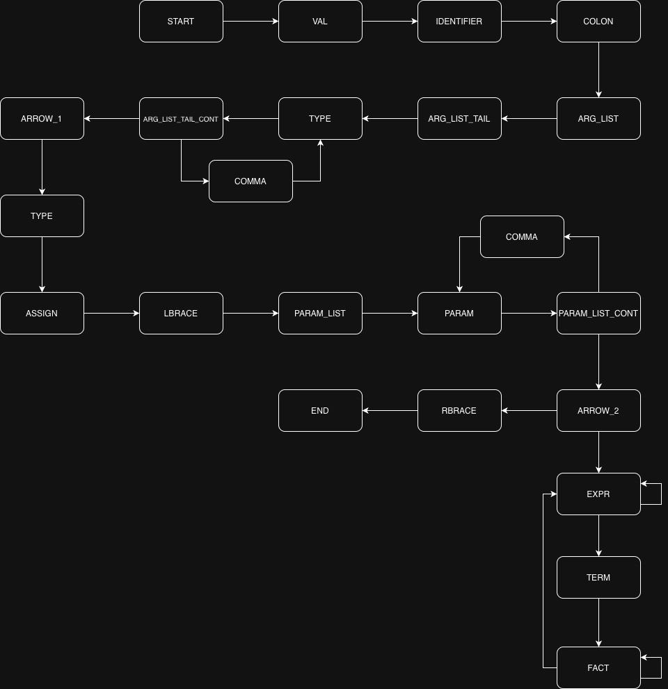

# Лабораторная работа 3. Разработка синтаксического анализатора (парсера)

## Цель работы
Изучить назначение и принципы работы синтаксического анализатора в структуре компилятора. Спроектировать грамматику, построить соответствующую схему метода анализа грамматики и выполнить программную реализацию парсера с нейтрализацией синтаксических ошибок методом Айронса. Интегрировать разработанный модуль в ранее созданный графический интерфейс языкового процессора.

## Сведения об авторе
Лабораторную работу выполнил студент группы АВТ-313, Герасимов Сергей Павлович.

## Вариант задания
### Вариант:
Лямбда-выражение на Kotlin

### Пример корректной строки:
1. `val calc: (Int, Int, Int) -> Int = { a, b, c -> a + (b * c) }`

## Разработка грамматики
1.	`<START> -> ‘val’ <VAL>`
2.	`<VAL>   -> ‘ ’ <SPACE>`
3.	`<SPACE> -> <IDENTIFIER>   <COLON>`
4.	`<COLON> -> ‘:’ <ARG_LIST>`
5.	`<ARG_LIST> -> ‘(‘ <ARG_LIST_TAIL>`
6.	`<ARG_LIST_TAIL> -> <TYPE> <ARG_LIST_TAIL_CONT>`
7.	`<ARG_LIST_TAIL_CONT> -> ',' <TYPE> <ARG_LIST_TAIL_CONT> | ')' '->' <ARROW_1>`
8.	`<ARROW_1> -> <TYPE> <ASSIGN>`
9.	`<ASSIGN> -> ‘=’ <LBRACE>`
10.	`<LBRACE> -> ‘{‘ <PARAM_LIST> <ARROW_2>`
11.	`<PARAM> -> <IDENTIFIER> | '_'`
12.	`<PARAM_LIST> -> <PARAM> <PARAM_LIST_CONT>`
13.	`<PARAM_LIST_CONT> -> ',' <PARAM> <PARAM_LIST_CONT> | ε`
14.	`<ARROW_2> -> '->' <EXPR> <RBRACE>`
15.	`<EXPR> -> <TERM> <EXPR_TAIL>`
16.	`<EXPR_TAIL> -> ‘+’ <TERM> <EXPR_TAIL> | ‘-‘ <TERM> <EXPR_TAIL> | ε`
17.	`<TERM> -> <FACTOR> <TERM_TAIL>`
18.	 `<TERM_TAIL> -> ‘*’ <FACTOR> <TERM_TAIL> | ‘/’ <FACTOR> <TERM_TAIL> | ε`
19.	`<FACTOR> -> <IDENTIFIER> | <NUMBER> | ‘(‘ <EXPR> ’)’` 
20.	`<RBRACE> -> ‘}’ <END>` 
21.	`<END> -> ‘;’`
22.	`<TYPE> -> ‘Int’ | ‘String’ | ‘Double’ | ‘Float’`
23.	 `<IDENTIFIER>   -> letter <ID_TAIL>`
24.	`<ID_TAIL>   ->  letter <ID_TAIL> | digit <ID_TAIL> | ‘_’ <ID_TAIL> | ε`
25.	 `<NUMBER>   ->  digit <NUM_TAIL>`
26.	`<NUM_TAIL>   ->  digit <NUM_TAIL> | ε`

## Диаграмма грамматики


## Классификация грамматики (по Хомскому)
Данная грамматика является контекстно-свободной.

## Метод анализа
Выбран метод рекурсивного спуска. Это нисходящий алгоритм, где для каждого нетерминала грамматики создается отдельная функция.


## Диагностика и нейтрализация синтаксических ошибок
В программе реализован метод Айронса (паническая синхронизация по ключевым токенам). При обнаружении ошибки анализатор пропускает входные токены до ближайшей точки синхронизации (`)`, `}`, `;`) и продолжает разбор, чтобы найти следующие ошибки.

## Тестовые примеры

### Корректная строка
`val calc: (Int, Int, Int) -> Int = { a, b, c -> a + (b * c) }`


### Строка с ошибкой
`val calc (Int, Int, Int) -> Int = { a, b, c -> a + (b * c) }`


## Запуск проекта
```bash
pip install PyQt6 antlr4-python3-runtime
python3 main.py
```
