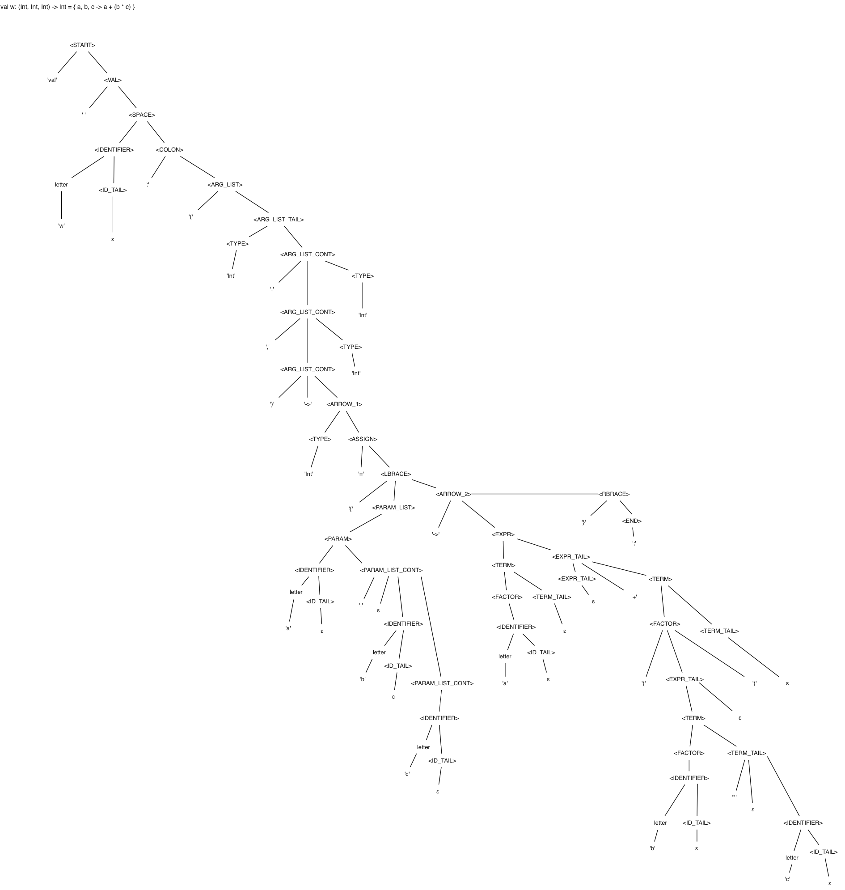
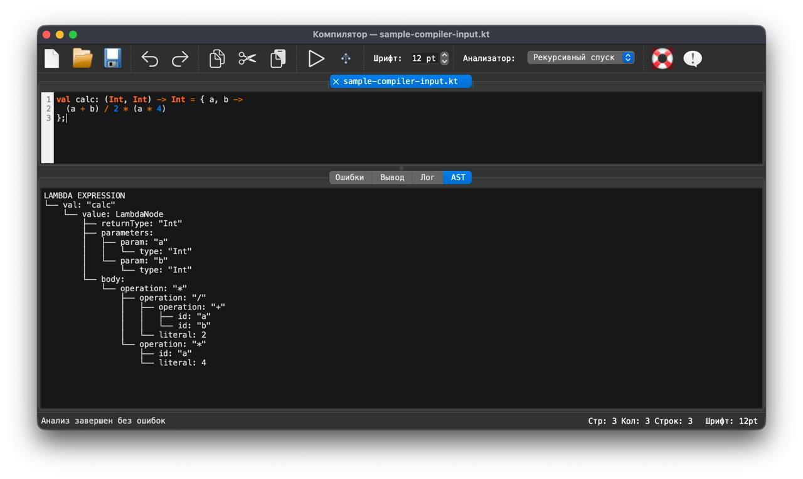
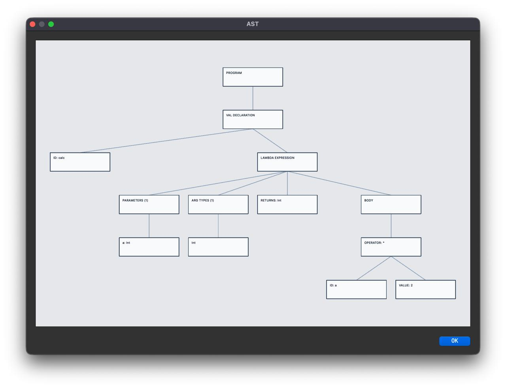

# Лабораторная работа 5. Построение AST и проверка контекстно-зависимых условий

## Цель работы
Изучить назначение и принципы работы семантического анализатора в структуре компилятора.
Освоить методы построения абстрактного синтаксического дерева (AST) и проверки контекстно-зависимых условий для заданной синтаксической конструкции.

## Сведения об авторе
Лабораторную работу выполнил студент группы АВТ-313, Герасимов Сергей Павлович.

## Вариант задания
Индивидуальный вариант:

```kotlin
val calc: (Int, Int, Int) -> Int = { a, b, c -> a + (b * c) };
```

Примеры корректных строк:

```kotlin
val calc: (Int, Int, Int) -> Int = { a, b, c -> a + (b * c) };
val f: (Int, Int, Int) -> Int = { x, y, z -> x + y + z };
val mulAdd: (Int, Int, Int) -> Int = { a, b, c -> a + (b * 10) };
```
## Контекстно-зависимые условия

Ниже перечислены реализованные проверки с примерами и ожидаемыми сообщениями.

### 1. Уникальность идентификаторов

Проверяется:

- повторное объявление переменной в глобальной области;
- повторные имена параметров в одной лямбда-области.

Пример:

```kotlin
val calc: (Int, Int, Int) -> Int = { a, b, c -> a + b + c };
val calc: (Int, Int, Int) -> Int = { x, y, z -> x + y + z };
```

Ожидаемое сообщение:

```text
Ошибка: идентификатор "calc" уже объявлен ранее (строка 1)
```

### 2. Совместимость типов

Проверяется совместимость типа выражения в лямбда-теле с объявленным возвращаемым типом.

Пример:

```kotlin
val calc: (Int, Int, Int) -> String = { a, b, c -> a + (b * c) };
```

Ожидаемое сообщение:

```text
Ошибка: тип инициализирующего значения 'Int' не совместим с объявленным типом 'String'
```

### 3. Допустимые значения

Проверяется диапазон числовых литералов для типа Int:

```text
[-2147483648; 2147483647]
```

Пример:

```kotlin
val calc: (Int, Int, Int) -> Int = { a, b, c -> a + 9999999999 };
```

Ожидаемое сообщение:

```text
Ошибка: значение 9999999999 выходит за допустимый диапазон для типа Int (-2147483648..2147483647)
```

### 4. Использование идентификаторов

Проверяется, что идентификаторы в выражении объявлены ранее в доступной области видимости.

Пример:

```kotlin
val calc: (Int, Int, Int) -> Int = { a, b, c -> a + d };
```

Ожидаемое сообщение:

```text
Ошибка: идентификатор "d" используется до объявления
```

## Структура AST

Описание узлов:

- `ProgramNode` - корень программы, список объявлений.
- `ValDeclNode` - объявление `val` (имя, модификаторы, тип, значение).
- `FunctionTypeNode` - функциональный тип `(T1, T2, ...) -> R`.
- `TypeNode` - конкретный тип (`Int`, `String`, `Double`, `Float`, `Boolean`).
- `LambdaNode` - лямбда-выражение (параметры, тело).
- `ParamNode` - параметр лямбды (имя, выведенный тип).
- `BinaryOpNode` - бинарная операция (`+`, `-`, `*`, `/`, `%`).
- `IdentifierNode` - использование идентификатора.
- `IntLiteralNode` - целочисленный литерал.

Рисунок AST для корректной строки:


## Графическая визуализация AST

### Для строки
```kotlin
val calc: (Int) -> Int = { a ->  a * 2};
```


## Инструкция по запуску

### Установка зависимостей

```bash
pip install PyQt6 antlr4-python3-runtime
```

### Запуск приложения

```bash
python3 main.py
```

### Использование

1. Введите строку кода в редактор.
2. Нажмите Пуск (`F5` или `Ctrl+R`).
3. Вкладка Ошибки покажет семантические/синтаксические сообщения с позициями.
4. Вкладка Вывод покажет текстовый AST.
5. Нажмите AST (`Ctrl+Shift+A`) для графической визуализации.

