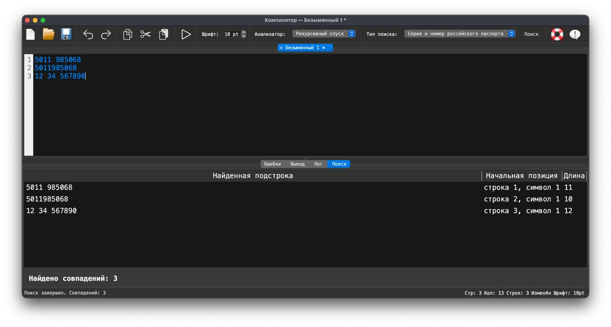
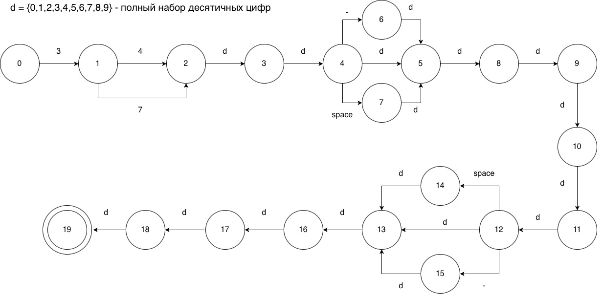
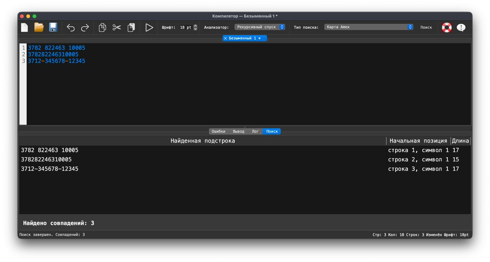
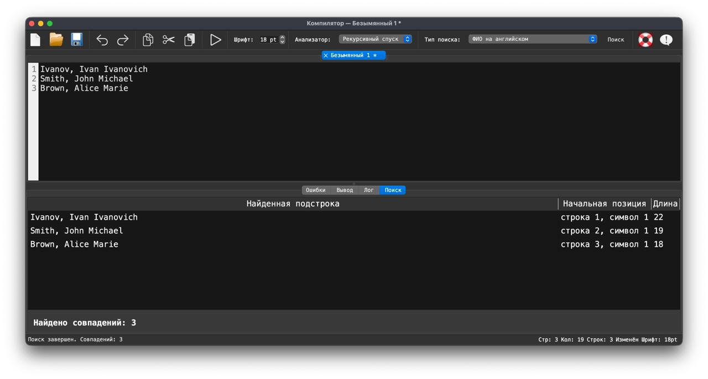

## Лабораторная работа 4. Реализация алгоритма поиска подстрок с помощью регулярных выражений

## Цель работы
Изучить теоретические основы регулярных выражений и их применение для поиска и извлечения подстрок из текста. Освоить практические навыки использования библиотечных средств работы с регулярными выражениями, а также интеграцию алгоритмов поиска в графический интерфейс приложения.

## Сведения об авторе
Лабораторную работу выполнил студент группы АВТ-313, Герасимов Сергей Павлович.

## Постановка задачи
Разработать модуль поиска подстрок с использованием регулярных выражений, интегрировать его в существующее приложение (текстовый редактор) и обеспечить наглядный вывод результатов.

### Вариант задания

- `22.` Построить РВ, описывающее серию и номер российского паспорта.
- `7.` Построить РВ, описывающее номер карты платежной системы Amex Card.
- `15.` Построить РВ, описывающее ФИО человека на английском языке (Last Name, First Name Middle Name).

### 1. Серия и номер российского паспорта

### Описание задачи
Построить РВ, описывающее серию и номер российского паспорта.

### Регулярное выражение с пояснением каждого обозначения
`^(?:\d{2}\s?\d{2})\s?\d{6}$`

- `^` - начало строки
- `(?:...)` - группирует символы без создания запоминающей группы
- `\d{2}` - ровно 2 цифры серии
- `\s?` - необязательный пробел между серией и второй частью серии
- `\d{2}` - еще 2 цифры серии
- `\s?` - необязательный пробел между серией и номером
- `\d{6}` - ровно 6 цифр номера
- `$` - конец строки

### Примеры строк, которые должны находиться
- `5011 985068`
- `5011985068`
- `12 34 567890`

### Примеры строк, которые не должны находиться
- `5011 98506` - слишком короткий номер
- `5011 9850689` - слишком длинный номер
- `50 11 98506A` - содержит недопустимый символ
- `5011-985068` - дефис не допускается в этом варианте



---

### 2. Карта Amex

### Описание задачи
Построить РВ, описывающее номер карты платежной системы Amex Card.

### Регулярное выражение с пояснением каждого обозначения
`^3[47]\d{2}[ -]?\d{6}[ -]?\d{5}$`

- `^` - начало строки
- `3` - номер карты должен начинаться с цифры 3
- `[47]` - вторая цифра только 4 или 7
- `\d{2}` - еще 2 цифры
- `[ -]?` - необязательный разделитель: пробел или дефис
- `\d{6}` - 6 цифр
- `[ -]?` - необязательный разделитель: пробел или дефис
- `\d{5}` - 5 цифр
- `$` - конец строки

### Примеры строк, которые должны находиться
- `3782 822463 10005`
- `378282246310005`
- `3712-345678-12345`

### Примеры строк, которые не должны находиться
- `5782 822463 10005` - не Amex, первая цифра не 3
- `3612 822463 10005` - вторая цифра не 4 или 7
- `3782 82246 10005` - неверная длина блока
- `3782 822463 100055` - слишком длинный номер
### Граф автомата


---

### 3. ФИО на английском языке

### Описание задачи
Построить РВ, описывающее ФИО человека на английском языке в формате: Last Name, First Name Middle Name.

### Регулярное выражение с пояснением каждого обозначения
`^[A-Z][a-z]+,\s[A-Z][a-z]+\s[A-Z][a-z]+$`

- `^` - начало строки
- `[A-Z]` - фамилия должна начинаться с заглавной латинской буквы
- `[a-z]+` - далее одна или более строчных латинских букв
- `,` - запятая после фамилии
- `\s` - один пробел
- `[A-Z]` - имя должно начинаться с заглавной латинской буквы
- `[a-z]+` - далее одна или более строчных латинских букв
- `\s` - один пробел
- `[A-Z]` - отчество должно начинаться с заглавной латинской буквы
- `[a-z]+` - далее одна или более строчных латинских букв
- `$` - конец строки

### Примеры строк, которые должны находиться
- `Ivanov, Ivan Ivanovich`
- `Smith, John Michael`
- `Brown, Alice Marie`

### Примеры строк, которые не должны находиться
- `ivanov, Ivan Ivanovich` - фамилия не с заглавной буквы
- `Ivanov Ivan Ivanovich` - нет запятой после фамилии
- `Ivanov, ivan Ivanovich` - имя не с заглавной буквы
- `Ivanov, Ivan` - не хватает третьего слова
- `Ivanov, Ivan Ivanovich1` - лишний символ в конце


## Запуск проекта
```bash
pip install PyQt6 antlr4-python3-runtime
python3 main.py
```
