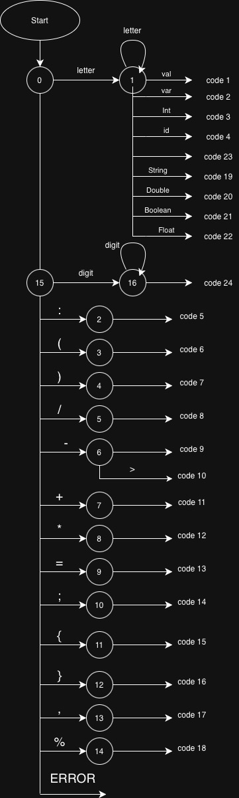
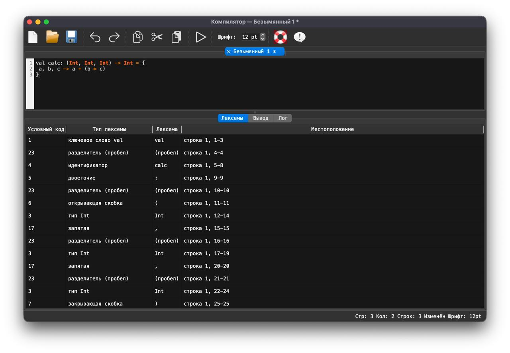
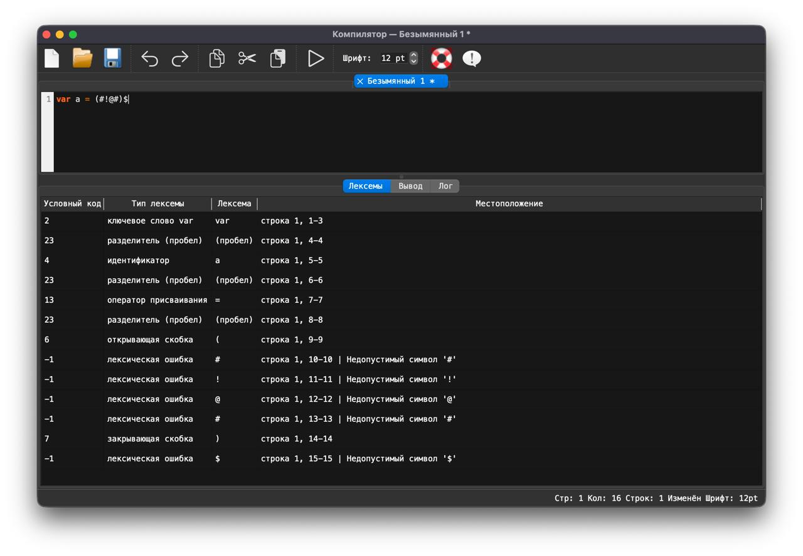

# Лабораторная работа 2. Разработка лексического анализатора (сканера)

## 1. Цель
Изучить назначение и принципы работы лексического анализатора в структуре компилятора. Спроектировать алгоритм (диаграмму состояний) и выполнить программную реализацию сканера для выделения лексем из входного текста. Интегрировать разработанный модуль в ранее созданный графический интерфейс языкового процессора.

---

## 2. Сведения об авторе

**Автор:** Студент группы АВТ-313 Герасимов Сергей Павлович

---

## 3. Вариант задания

**Лямбда-выражение Kotlin:**

```kotlin
val calc: (Int, Int, Int) -> Int = { a, b, c -> a + (b * c) }
```
---

## 4. Диаграмма состояний



---


### 5. Допустимые лексемы

| Код | Лексема       | Тип                         |
|---|---------------|-----------------------------|
| 1 | `val`         | ключевое слово              |
| 2 | `var`         | ключевое слово              |
| 3 | `Int`         | тип данных                  |
| 4 | идентификатор | идентификатор               |
| 5 | `:`           | двоеточие                   |
| 6 | `(`           | открывающая скобка          |
| 7 | `)`           | закрывающая скобка          |
| 8 | `/`           | оператор деления            |
| 9 | `-`           | оператор минус              |
| 10 | `->`          | оператор стрелка            |
| 11 | `+`           | оператор плюс               |
| 12 | `*`           | оператор умножения          |
| 13 | `=`           | оператор присваивания       |
| 14 | `;`           | конец оператора             |
| 15 | `{`           | открывающая фигурная скобка |
| 16 | `}`           | закрывающая фигурная скобка |
| 17 | `,`           | запятая                     |
| 18 | `%`           | оператор остатка            |
| 19 | `String`      | тип данных                  |
| 20 | `Double`      | тип данных                  |
| 21 | `Boolean`     | тип данных                  |
| 22 | `Float`       | тип данных                  |
| 23 | `Char`        | тип данных                  |
| 24 | (пробел)      | разделитель (пробел)        |

---

## 6. Тестовые примеры

### 6.1 Корректная строка

**Вход:**

```kotlin
val calc: (Int, Int, Int) -> Int = { a, b, c -> a + (b * c) }
```
**Результат:**


### 6.2 Строка с недопустимыми символами

**Вход:**

```kotlin
var a = (#!@#)$
```

**Результат:**


## 7. Запуск

```bash
pip install PyQt6
python3 main.py
```
